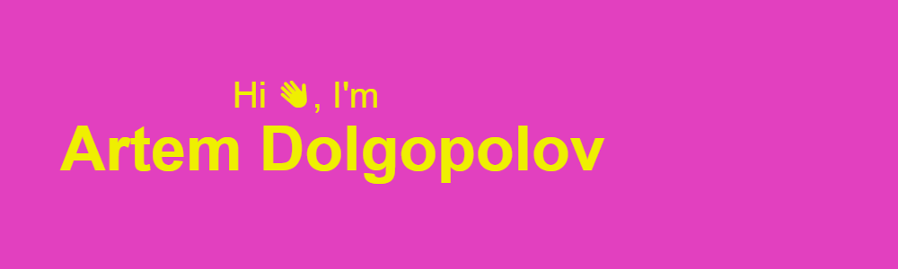

  

  <h1>
    
  </h1>

  
  ### :man_technologist: About Me :
  - 🔭 I am a beginning frontend developer with previous experience in bank lending.
  - 🌱 I'm currently looking for a job.
  - ✉️ You can find me here: 
  - ☝️ The significant part of my projects is on my school account (move it to my pesonal github account soon).
---

### :hammer_and_wrench: Languages and Tools :

  &nbsp;
  &nbsp;
  &nbsp;
  &nbsp;
  &nbsp;
  &nbsp;
  &nbsp;
  &nbsp;
  &nbsp;
  &nbsp;
  &nbsp;
  &nbsp;
  &nbsp;
  &nbsp;
  &nbsp;

---

### :fire: My Stats :

  
  

---

